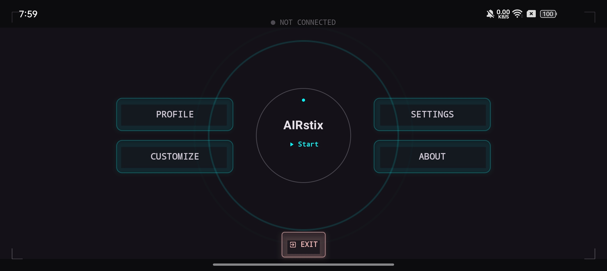
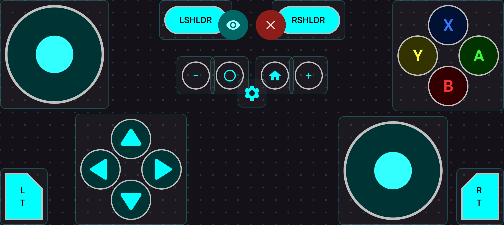
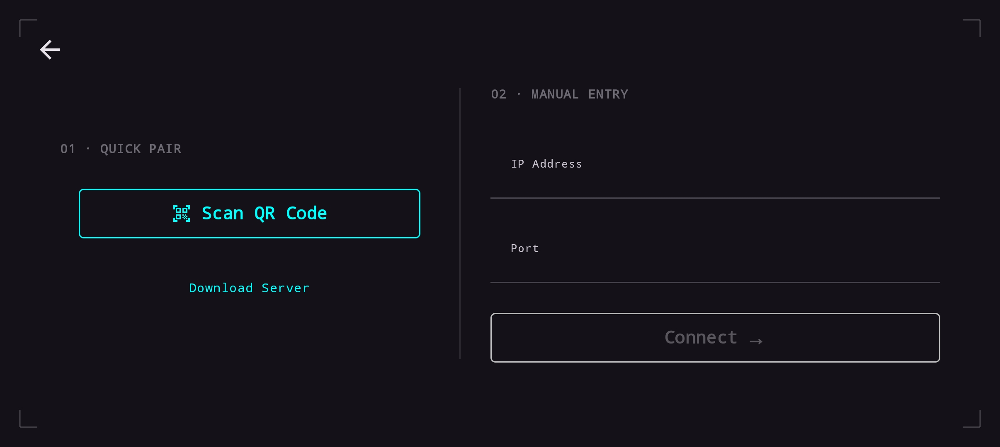
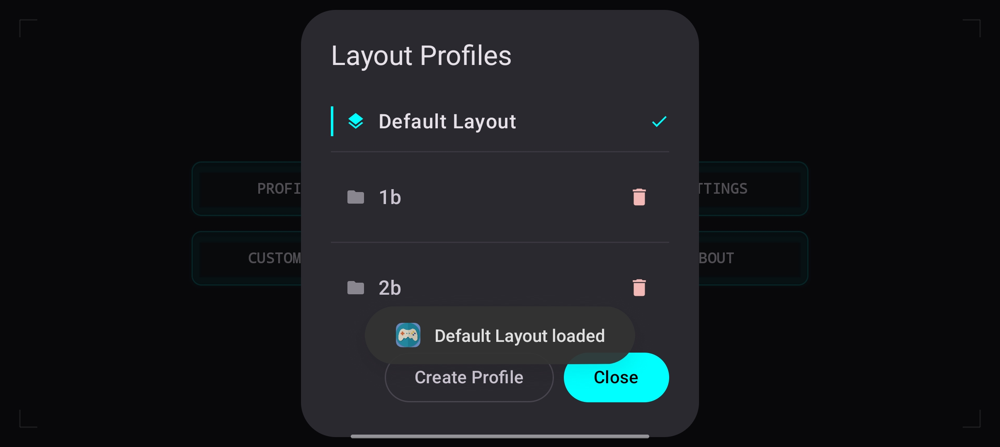
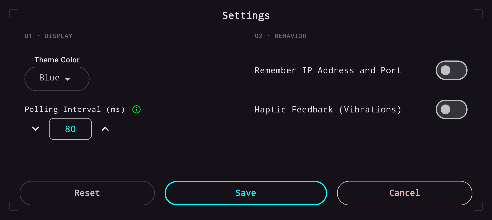

<div align="center">
  

  # AIRstix

  **Turn your Android phone into a wireless gamepad for PC.**

  AIRstix connects to the [AIRstix server](https://github.com/Amarthya-sg/AIRstix-server) over your local Wi-Fi and streams real-time gamepad input using a low-latency TCP connection with binary serialization.

  
  
  
  
  
  
</div>

---

## Screenshots

---

### Main Menu

<div align="center">
  
</div>

The app opens directly into the HUD-style main hub. A live connection status pill at the top center shows **NOT CONNECTED** / **CONNECTING** / **CONNECTED** at a glance. The central **AIRstix** circle is the primary action button — tap **▶ Start** to go to the connect screen, or resume an active session. Four surrounding buttons give quick access to every major section:

| Button | What it does |
|---|---|
| **PROFILE** | Open the Layout Profiles dialog to switch, create, import, or delete saved layouts |
| **CUSTOMIZE** | Enter the visual drag-and-drop gamepad layout editor |
| **SETTINGS** | Open the settings screen (display and behavior options) |
| **ABOUT** | App info and version details |

The **EXIT** button at the bottom cleanly terminates the app. Corner bracket decorations (HUD viewfinder) frame the screen, part of the sci-fi aesthetic that carries through every screen.

---

### Live Gamepad

<div align="center">
  
</div>

The full controller layout rendered on a dotted-grid background. Every control streams input to the PC server in real time at the configured polling interval (default 80 ms):

| Zone | Controls |
|---|---|
| Top center | **LSHLDR** (LB) and **RSHLDR** (RB) shoulder buttons — pill-shaped, tap or hold |
| Center top | **Eye (👁)** preview toggle and **✕** close/settings button |
| Center row | **− (Select)**, **○ (Home)**, **⌂ (Home)**, **+ (Start)** — the four system buttons |
| Center bottom | **⚙ Settings** — navigates back to Main Menu without dropping the connection |
| Top left | **Left Analog Stick** — circular thumb area with neon fill indicator |
| Bottom left | **D-Pad** — four individual directional arrow buttons |
| Bottom left corner | **LT trigger** — tab-style trigger tile |
| Top right | **A / B / X / Y** face buttons — color-coded (green A, red B, blue X, olive Y) |
| Bottom right | **Right Analog Stick** |
| Bottom right corner | **RT trigger** — tab-style trigger tile |

Tapping ⚙ sends a final zero-state frame (releases all buttons) and returns to the Main Menu while keeping the TCP session alive.

---

### Connect Screen

<div align="center">
  
</div>

Two parallel connection methods presented side by side, both framed by the HUD corner brackets:

**01 · Quick Pair**
- Tap **Scan QR Code** to open the camera and scan the QR code displayed by the AIRstix server — IP and port are parsed automatically, no typing needed.
- A **Download Server** link provides a shortcut to get the server software.

**02 · Manual Entry**
- Type the server's **IP Address** and **Port** directly into the text fields.
- Tap **Connect →** to initiate the TCP handshake.
- Input is validated before connecting — the button stays disabled until a valid IP and port are entered.

If the connection fails, a **Run Diagnostics** flow checks each step: Wi-Fi → local IP → subnet → ping → port reachability.

---

### Layout Profiles

<div align="center">
  
</div>

Accessed via **PROFILE** on the Main Menu. Stores and manages multiple named gamepad layouts:

- **Default Layout** — always present, marked with a teal left border and a ✓ checkmark when active. Cannot be deleted.
- **Custom profiles** (e.g. `1b`, `2b`) — created from the Customization editor or by importing a JSON file. Each shows a folder icon and a 🗑 delete button.
- **Tap any profile** to load it instantly. A snackbar at the bottom confirms which layout was loaded ("Default Layout loaded").
- **Create Profile** — saves the current layout under a new name.
- **Close** — dismisses the dialog and returns to the Main Menu.

---

### Settings

<div align="center">
  
</div>

Split into two sections, separated by a vertical divider:

**01 · Display**
- **Theme Color** — dropdown picker to choose the app's neon accent color (Blue selected by default; options include Red, Green, Yellow, Purple, Orange, Pink). Changes the color of all interactive elements, borders, and highlights across every screen.
- **Polling Interval (ms)** — spin box (↓ / ↑ arrows) controlling how often gamepad state is sent to the server. Default is **80 ms**. Lower values reduce input lag; higher values reduce CPU and network load.

**02 · Behavior**
- **Remember IP Address and Port** — toggle. When on, the last-used server address is pre-filled on the Connect screen.
- **Haptic Feedback (Vibrations)** — toggle. When enabled, the phone vibrates on every button press. An additional **Haptic Intensity** selector (Soft / Medium / Strong) appears when this is turned on.

Three action buttons at the bottom:
- **Reset** — reverts all settings to factory defaults
- **Save** — persists the current values (highlighted in teal as the primary action)
- **Cancel** — discards changes and returns to Main Menu

---

## Table of Contents

- [AIRstix](#airstix)
  - [Screenshots](#screenshots)
    - [Main Menu](#main-menu)
    - [Live Gamepad](#live-gamepad)
    - [Connect Screen](#connect-screen)
    - [Layout Profiles](#layout-profiles)
    - [Settings](#settings)
  - [Table of Contents](#table-of-contents)
  - [Features](#features)
    - [Controller](#controller)
    - [Connection](#connection)
    - [Customization](#customization)
    - [Display \& Feel](#display--feel)
    - [Performance](#performance)
  - [How It Works](#how-it-works)
    - [Wire Format](#wire-format)
  - [Getting Started](#getting-started)
    - [Prerequisites](#prerequisites)
    - [Clone](#clone)
    - [Build](#build)
    - [Install on a connected device](#install-on-a-connected-device)
  - [Connecting to a Server](#connecting-to-a-server)
  - [Gamepad Layout](#gamepad-layout)
  - [Customization](#customization-1)
    - [Options menu](#options-menu)
    - [Layout Profiles](#layout-profiles-1)
  - [Settings](#settings-1)
  - [Building for Release](#building-for-release)
  - [Testing](#testing)
    - [Test Coverage](#test-coverage)
    - [CI](#ci)
  - [Project Structure](#project-structure)
  - [Tech Stack](#tech-stack)
  - [Permissions](#permissions)
  - [Related](#related)
  - [License](#license)

---

## Features

### Controller
- **Full Xbox-style layout** — dual analog sticks, D-Pad, A/B/X/Y face buttons, LT/RT triggers, LB/RB shoulder buttons, Select (−), Start (+), Home, Capture
- **Grouped or ungrouped controls** — toggle face buttons and D-Pad between grouped and individual button modes
- **Persistent connection** — the session stays alive while navigating between screens (Settings, Main Menu) without dropping

### Connection
- **Wireless over TCP/IP** — streams input to the AIRstix server on your local Wi-Fi network
- **QR code quick pair** — scan the QR code shown by the server to connect instantly, no typing required
- **Manual entry fallback** — enter IP address and port directly if QR is unavailable
- **Connection diagnostics** — step-by-step checks: Wi-Fi state → local IP → subnet reachability → ping → port availability

### Customization
- **Visual layout editor** — drag every control to any position on a live dotted-grid canvas
- **Per-button properties** — visibility, scale, opacity, offset, and anchor point (TL / TR / BL / BR) per control
- **Layout profiles** — save, switch, create, import, and export named layouts as JSON files
- **Default Layout** — always available as a factory-reset baseline

### Display & Feel
- **HUD / sci-fi aesthetic** — corner bracket decorations, monospace typography, neon accent palette
- **Seven accent colors** — Red, Green, Blue, Yellow, Purple, Orange, Pink — each with neon (dark) and glossy (light) rendering
- **Full-screen mode** — hides system bars for a clean controller view, enabled by default
- **Haptic feedback** — configurable vibration on every button press with Soft / Medium / Strong intensity
- **Landscape-locked** — activity stays in landscape orientation at all times

### Performance
- **Configurable polling rate** — 10 ms to 500 ms (default 80 ms); lower = faster input, higher CPU cost
- **Low-latency socket tuning** — `TCP_NODELAY` + `IPTOS_LOWDELAY` on every connection
- **Save connection credentials** — optionally remembers last-used IP and port across sessions

---

## How It Works

The app opens a TCP socket to the AIRstix server. Gamepad state (button presses, analog stick positions, trigger values) is serialized using [Colfer](https://github.com/pascaldekloe/colfer) binary encoding and sent at the configured polling interval.

### Wire Format

Defined in [`VGP_Data_Exchange/GamePadReading.colf`](VGP_Data_Exchange/GamePadReading.colf), modeled after the [Windows GamepadReading API](https://learn.microsoft.com/en-us/uwp/api/windows.gaming.input.gamepadreading):

```
package VGP_Data_Exchange

type GamepadReading struct {
    ButtonsUp         uint32   // bitmask — buttons released this frame
    ButtonsDown       uint32   // bitmask — buttons held this frame
    LeftTrigger       float32  // [0.0, 1.0]
    RightTrigger      float32  // [0.0, 1.0]
    LeftThumbstickX   float32  // circular [-1.0, 1.0]
    LeftThumbstickY   float32  // circular [-1.0, 1.0]
    RightThumbstickX  float32  // circular [-1.0, 1.0]
    RightThumbstickY  float32  // circular [-1.0, 1.0]
}
```

Thumbstick values are circular — `(0.7, 0.7)` is a valid corner; `(1.0, 1.0)` is out of range. Button bits follow the [Windows GamepadButtons enum](https://learn.microsoft.com/en-us/uwp/api/windows.gaming.input.gamepadbuttons).

The `VGP_Data_Exchange` directory is a git submodule providing generated Java and C sources from the schema.

---

## Getting Started

### Prerequisites

| Requirement | Version |
|---|---|
| JDK | 21 (Temurin recommended) |
| Android Studio | Latest stable |
| Android device / emulator | API 26+ (Android 8.0+) |
| AIRstix server | Running on the same local network |

### Clone

```bash
git clone --recurse-submodules https://github.com/Amarthya-sg/AIRstix.git
```

If you already cloned without `--recurse-submodules`:

```bash
git submodule update --init --recursive
```

### Build

```bash
./gradlew assemble
```

### Install on a connected device

```bash
./gradlew installDebug
```

Or open the project in Android Studio and run it directly.

---

## Connecting to a Server

1. Start the [AIRstix server](https://github.com/Amarthya-sg/AIRstix-server) on your PC.
2. Make sure both devices are on the same Wi-Fi network.
3. Open the app — the Main Menu shows **NOT CONNECTED** in the status bar at the top.
4. Tap **▶ Start** in the center hub.
5. Either:
   - **01 · Quick Pair** — tap **Scan QR Code** and scan the QR shown by the server, or
   - **02 · Manual Entry** — type the IP address and port, then tap **Connect →**
6. On success the app returns to the Main Menu showing **CONNECTED**. Tap **▶ Start** again to enter the live gamepad screen.

> If the connection fails, a **Run Diagnostics** option walks through each network check step by step.

---

## Gamepad Layout

| Zone | Controls |
|---|---|
| Top center | LB (LSHLDR), RB (RSHLDR) shoulder buttons |
| Center | Select (−), Home (○), Home (⌂), Start (+), Settings (⚙) |
| Left | Left Analog Stick, LT trigger |
| Bottom left | D-Pad (Up / Down / Left / Right) |
| Right | A / B / X / Y face buttons, RT trigger |
| Bottom right | Right Analog Stick |

---

## Customization

Open **CUSTOMIZE** from the Main Menu to enter the visual layout editor.

- **Drag** any control freely across the dotted-grid canvas.
- **Double-tap** a control to open its property panel — toggle visibility, adjust scale and opacity, set anchor point.
- **Group / Ungroup** face buttons or D-Pad to move them as a unit or individually.
- **Preview** the layout with the eye (👁) button.

### Options menu

| Action | Description |
|---|---|
| Save | Persist the current layout |
| Import Config | Load a layout from a `.json` file |
| Export Config | Write the current layout to a `.json` file |
| Reset Defaults | Restore the factory layout |

### Layout Profiles

Tap **PROFILE** from the Main Menu to open the profile dialog.

- **Default Layout** is always present and cannot be deleted.
- Saved or imported configs appear as named profiles (e.g. `1b`, `2b`).
- Tap a profile to load it instantly — a snackbar confirms "Default Layout loaded".
- Tap the 🗑 icon to delete a custom profile.
- Tap **Create Profile** to save the current layout under a new name.

---

## Settings

Open **SETTINGS** from the Main Menu.

| # | Section | Setting | Default | Notes |
|---|---|---|---|---|
| 01 | Display | Theme Color | Blue | Red / Green / Blue / Yellow / Purple / Orange / Pink |
| 01 | Display | Polling Interval (ms) | 80 | Range: 10–500 ms |
| 02 | Behavior | Remember IP Address and Port | Off | Saves last-used credentials |
| 02 | Behavior | Haptic Feedback (Vibrations) | Off | Vibrate on button press |

> When Haptic Feedback is enabled a Haptic Intensity selector appears: **Soft / Medium / Strong**.

Use **Save** to apply changes, **Reset** to restore defaults, or **Cancel** to discard.

---

## Building for Release

Create `signing.properties` in the project root — this file is gitignored and must never be committed:

```properties
STORE_FILE=/absolute/path/to/your.keystore
STORE_PASSWORD=your_store_password
KEY_ALIAS=your_key_alias
KEY_PASSWORD=your_key_password
```

A template is provided at [`signing.properties.template`](signing.properties.template).

Build the signed release APK:

```bash
./gradlew assembleRelease
```

If `signing.properties` is absent, the build falls back to the debug signing config automatically.

---

## Testing

```bash
# Unit tests
./gradlew test

# Instrumented tests (requires device or emulator)
./gradlew connectedCheck

# Lint
./gradlew lint

# Everything together (mirrors CI)
./gradlew build lint test
```

### Test Coverage

| Suite | Location | What it covers |
|---|---|---|
| Unit | `app/src/test/` | `NetworkDiagnostics` subnet logic |
| Instrumented E2E | `app/src/androidTest/` | Connection lifecycle, gamepad input, navigation, settings |

E2E tests use `TestGamepadServer` — a loopback TCP server that deserializes incoming `GamepadReading` frames for assertion.

### CI

GitHub Actions runs on every push and pull request:

- **Job 1** — Build, lint, unit tests
- **Job 2** — Instrumented tests on API **26**, **34**, and **36** in parallel via [Android Emulator Runner](https://github.com/ReactiveCircus/android-emulator-runner)

---

## Project Structure

```
.
├── app/
│   └── src/
│       ├── main/
│       │   ├── AndroidManifest.xml
│       │   └── java/io/github/amarthyasg/airstix/
│       │       ├── MainActivity.kt                    # Entry point & navigation graph
│       │       ├── data/
│       │       │   ├── BaseColor.kt                   # Accent color enum + color resolution
│       │       │   ├── ButtonComponent.kt             # ButtonComponent, ButtonConfig, ButtonAnchor
│       │       │   ├── ColorScheme.kt
│       │       │   ├── Defaults.kt                    # Default settings & button layout configs
│       │       │   ├── HapticIntensity.kt
│       │       │   ├── Preview.kt                     # Compose preview helpers
│       │       │   └── SettingsRepository.kt          # DataStore-backed settings persistence
│       │       ├── network/
│       │       │   ├── ConnectionState.kt             # UI state model
│       │       │   ├── ConnectionViewModel.kt         # TCP socket, command queue
│       │       │   ├── ConnectionViewModelFactory.kt
│       │       │   ├── NetworkCommand.kt              # Sealed command types
│       │       │   └── NetworkDiagnostics.kt          # Wi-Fi / IP / subnet / ping / port checks
│       │       └── ui/
│       │           ├── components/
│       │           │   └── QRCodeScanner.kt           # ZXing QR scanner wrapper
│       │           ├── composables/
│       │           │   ├── AnalogStick.kt
│       │           │   ├── BoundedNumericInput.kt
│       │           │   ├── ButtonConfigEditor.kt
│       │           │   ├── CentralButtons.kt          # LB/RB, −, ○, ⌂, +, ⚙
│       │           │   ├── Circle.kt
│       │           │   ├── ColorSchemePicker.kt
│       │           │   ├── Dpad.kt
│       │           │   ├── FaceButtons.kt             # A / B / X / Y
│       │           │   ├── Gamepad.kt                 # Full gamepad layout & routing
│       │           │   ├── GamepadCustomizationEditor.kt
│       │           │   ├── HUDViewfinder.kt           # Corner bracket decoration
│       │           │   ├── ListItemPicker.kt
│       │           │   ├── ResponsiveGrid.kt
│       │           │   ├── SpinBox.kt
│       │           │   └── Trigger.kt                 # LT / RT
│       │           ├── screens/
│       │           │   ├── AboutScreen.kt
│       │           │   ├── ConnectScreen.kt           # QR scan + manual IP/port entry
│       │           │   ├── ConnectingScreen.kt        # Progress, success, error + diagnostics
│       │           │   ├── ConnectionLostScreen.kt
│       │           │   ├── Gamepad.kt                 # Live gamepad screen & polling loop
│       │           │   ├── GamepadCustomization.kt    # Visual drag editor + options menu
│       │           │   ├── MainMenu.kt                # HUD hub, profile dialog, Resume button
│       │           │   └── SettingsScreen.kt
│       │           ├── theme/
│       │           │   ├── Color.kt                   # Neon/Glossy palette
│       │           │   ├── Shape.kt
│       │           │   ├── Theme.kt                   # Dynamic dark/light color schemes
│       │           │   ├── ThemePreview.kt
│       │           │   └── Type.kt
│       │           └── utils/
│       │               ├── FindActivity.kt
│       │               ├── HapticUtils.kt
│       │               └── LockScreenOrientation.kt
│       └── androidTest/
│           ├── TestGamepadServer.kt                   # Loopback TCP server for E2E tests
│           └── e2e/
│               ├── ConnectionE2ETest.kt
│               ├── GamepadInputE2ETest.kt
│               ├── NavigationE2ETest.kt
│               └── SettingsE2ETest.kt
├── Images/                                            # App screenshots
│   ├── 01_main_menu.jpg
│   ├── 02_settings.jpg
│   ├── 03_layout_profiles.jpg
│   ├── 04_gamepad.jpg
│   └── 05_connect.jpg
├── VGP_Data_Exchange/                                 # Git submodule — Colfer schema + generated code
│   ├── GamePadReading.colf                            # Wire format schema
│   ├── C/                                             # Generated C sources
│   └── io/github/kitswas/VGP_Data_Exchange/           # Generated Java sources
├── fastlane/metadata/android/                        # Store listing metadata & screenshots
├── gradle/
│   ├── libs.versions.toml                             # Centralized dependency versions
│   └── wrapper/
├── .github/
│   ├── ISSUE_TEMPLATE/
│   └── workflows/
│       ├── build_and_test.yaml
│       └── validate_fastlane.yaml
├── build.gradle.kts
├── settings.gradle.kts
├── mise.toml                                          # Tool version management (Java 21)
├── signing.properties.template
└── gradlew / gradlew.bat
```

---

## Tech Stack

| Component | Library / Tool | Version |
|---|---|---|
| Language | Kotlin | 2.3.20 |
| UI | Jetpack Compose + Material3 | BOM 2026.03.01 |
| Navigation | Navigation Compose | 2.9.7 |
| State | ViewModel + StateFlow | lifecycle 2.10.0 |
| Persistence | DataStore Preferences | 1.2.1 |
| Serialization | kotlinx.serialization-json | 1.10.0 |
| QR scanning | ZXing Android Embedded | 4.3.0 |
| Wire encoding | Colfer (VGP_Data_Exchange submodule) | — |
| Documentation | Dokka | 2.2.0 |
| Build | Android Gradle Plugin | 9.1.0 |
| Min SDK | Android 8.0 | API 26 |
| Compile SDK | — | API 36 |
| Java | — | 21 |

---

## Permissions

| Permission | Reason |
|---|---|
| `INTERNET` | TCP connection to the AIRstix server |
| `ACCESS_NETWORK_STATE` | Network diagnostics before connecting |
| `VIBRATE` | Haptic feedback on button press |

---

## Related

- **PC Server:** [AIRstix-server](https://github.com/Amarthya-sg/AIRstix-server) — the Linux-focused server that receives input from this app
- **Data Exchange Spec:** [VGP_Data_Exchange](https://github.com/kitswas/VGP_Data_Exchange) — Colfer schema and generated sources for the wire format

---

## License

See [LICENCE.TXT](LICENCE.TXT) — GNU General Public License v3.0.
