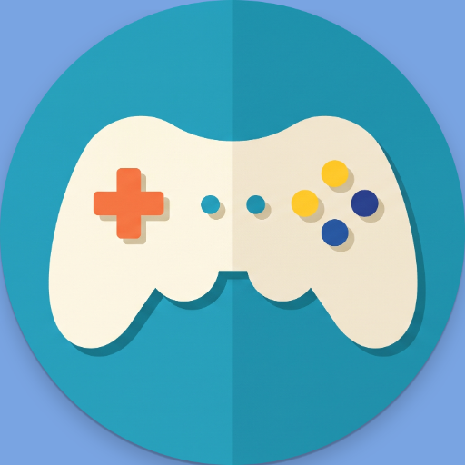
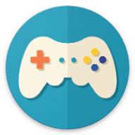
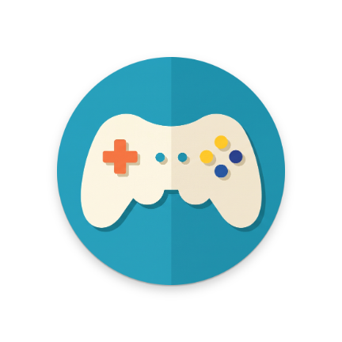

# AIRstix — App Icons & Screenshots

---

## App Icons

### Play Store / F-Droid Icon
> Used for store listings (Google Play, F-Droid). Full 512×512 high-res icon.

`app/src/main/ic_launcher-playstore.png`

---

### Launcher Icon (Round)
> Shown on the Android home screen on devices that use round icon shapes (Android 7.1+).

`app/src/main/res/mipmap-xxxhdpi/ic_launcher_round.png`

---

### Launcher Icon (Foreground)
> The foreground layer of the adaptive icon — the gamepad artwork without the background. Used by Android to compose the adaptive icon at runtime.

`app/src/main/res/mipmap-xxxhdpi/ic_launcher_foreground.png`

---

### Launcher Icon (Background)
> The background layer of the adaptive icon — the solid blue fill behind the gamepad. Paired with the foreground layer by Android's adaptive icon system.

`app/src/main/res/mipmap-xxxhdpi/ic_launcher_background.png`

---

### Monochrome Icon
> Single-colour version used for themed icon support (Android 13+). Renders in the system's chosen tint colour over a neutral background.

`app/src/main/res/mipmap-xxxhdpi/ic_launcher_monochrome.png`

---

### F-Droid / Fastlane Icon
> Icon used by the Fastlane supply tool for F-Droid and other store submissions.

`fastlane/metadata/android/en-US/images/icon.png`

---

### Feature Graphic
> Banner graphic used on the Play Store and F-Droid store listing page (1024×500).

`fastlane/metadata/android/en-US/images/featureGraphic.png`

---

### Adaptive Icon Density Variants

The launcher icon is provided at all standard Android density buckets:

| Density | Path | Size |
|---|---|---|
| mdpi (1×) | `app/src/main/res/mipmap-mdpi/` | 48×48 dp |
| hdpi (1.5×) | `app/src/main/res/mipmap-hdpi/` | 72×72 dp |
| xhdpi (2×) | `app/src/main/res/mipmap-xhdpi/` | 96×96 dp |
| xxhdpi (3×) | `app/src/main/res/mipmap-xxhdpi/` | 144×144 dp |
| xxxhdpi (4×) | `app/src/main/res/mipmap-xxxhdpi/` | 192×192 dp |

Each density folder contains four variants: `ic_launcher_background.png`, `ic_launcher_foreground.png`, `ic_launcher_monochrome.png`, `ic_launcher_round.png`.

---

## Screenshots

---

### Main Menu

The HUD-style home hub. A live status pill at the top shows connection state (**NOT CONNECTED / CONNECTING / CONNECTED**) at a glance. The central **AIRstix** button is the primary action — tap **▶ Start** to connect or resume a live session. Four surrounding buttons give quick access to every section:

| Button | Action |
|---|---|
| **PROFILE** | Switch, create, import, or delete saved layouts |
| **CUSTOMIZE** | Enter the drag-and-drop gamepad layout editor |
| **SETTINGS** | Display and behavior options |
| **ABOUT** | App info and version |

**EXIT** cleanly terminates the app. Sci-fi corner bracket decorations (HUD viewfinder) frame the screen.

---

### Live Gamepad

The full controller rendered on a dotted-grid background. Streams input to the PC server in real time at the configured polling interval (default 80 ms):

| Zone | Controls |
|---|---|
| Top center | **LSHLDR** (LB) and **RSHLDR** (RB) shoulder buttons |
| Center | **−** Select, **○** / **⌂** Home, **+** Start |
| Top left | Left Analog Stick |
| Bottom left | D-Pad + **LT** trigger |
| Top right | **A / B / X / Y** face buttons |
| Bottom right | Right Analog Stick + **RT** trigger |

Tapping **⚙** sends a final zero-state frame and returns to the Main Menu without dropping the TCP session.

---

### Connect Screen

Two connection methods side by side:

- **Quick Pair** — tap **Scan QR Code** and point the camera at the QR shown by the server. IP and port are parsed automatically, no typing needed.
- **Manual Entry** — type the server IP address and port, then tap **Connect →**. Input is validated before the button becomes active.

If the connection fails, a **Run Diagnostics** flow checks each step: Wi-Fi → local IP → subnet → ping → port reachability.

---

### Layout Profiles

Manages saved gamepad layouts:

- **Default Layout** — always present, marked with a teal border and ✓ when active. Cannot be deleted.
- **Custom profiles** — created from the Customization editor or imported as JSON files. Each has a 🗑 delete button.
- Tap any profile to load it instantly. A snackbar confirms which layout was applied.
- **Create Profile** — saves the current layout under a new name.

---

### Settings

Split into two sections:

**01 · Display**
- **Theme Color** — neon accent color across all screens (Red, Green, Blue, Yellow, Purple, Orange, Pink)
- **Polling Interval** — how often input is sent to the server (10–500 ms, default 80 ms)

**02 · Behavior**
- **Remember IP Address and Port** — pre-fills the last-used server address on the Connect screen
- **Haptic Feedback** — vibrate on button press. When enabled, a **Haptic Intensity** selector appears (Soft / Medium / Strong)

Three action buttons: **Reset** · **Save** · **Cancel**
